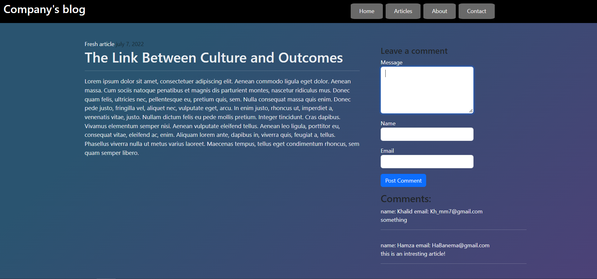
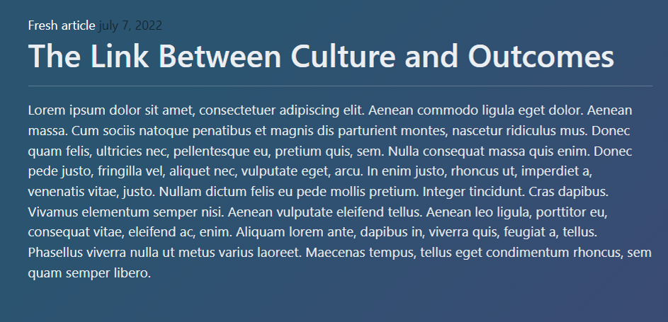
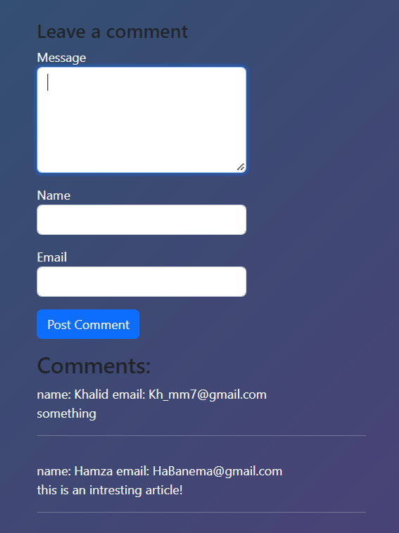

# Company's blog
this is an assessment for a Simplelearn Full Stack Web Developer - MERN first course that requires to develop a blogging page for a company's website so new employees can have more information about the articles that get posted on the website.

## Blogging Page


## Tools and softwares

- ### Git
- ### Github 
- ### Visual Studio Code
- ### Bootstrap
- ### HTML/CSS
- ### Javascript

## .gitignore
this file contains the ignored files

## pushing into Github

- git and github are used as version controls, and has been installed and used with the following steps:

```
echo "# BlogProject" >> README.md
git init
git add README.md
git commit -m "first commit"
git branch -M main
git remote add origin https://github.com/abinsaid/BlogProject.git
git push -u origin main
```
- pushing the website files into the github:
```
git add images/ README.md style.css .gitignore index.html
git push
git commit
```

## Navigation bar


- the navigation bar has been made with HTML and CSS as the following code shows:
```
<nav>
    <div style="padding: 10px">
      <label><h2 style="margin-right: 750px">Company's blog</h2></label>
      <button type="button" class="button1">Home</button>
        <button type="button" class="button1">Articles</button>
        <button type="button" class="button1">About</button>
        <button type="button" class="button1">Contact</button>
    </div>
  </nav>
  ```
  ## Article
  
  - the article is displayed in the half of the screen with using HTML, CSS, and Bootstrap:

```
 <div class="container">
    <div class="row pt-5">
  <div class="col-8 ps-5 pe-5 content-area">
    <Bold class="artic"style="color: white">Fresh article</Bold> <Bold class="artic" style="color: #14252b"> july 7, 2022</Bold>
    <h1 class="text" style="align-self:left">The Link Between Culture and Outcomes</h1>
        <hr>
        <p style="font-size: 17px">Lorem ipsum dolor sit amet, consectetuer adipiscing elit. Aenean commodo ligula eget dolor. Aenean massa. Cum sociis natoque penatibus et magnis dis parturient montes, nascetur ridiculus mus. Donec quam
           felis, ultricies nec, pellentesque eu, pretium quis, sem. Nulla consequat massa quis enim. Donec pede justo, fringilla vel, aliquet nec, vulputate eget, arcu. In enim justo, rhoncus ut, imperdiet a, venenatis vitae, justo. Nullam dictum felis eu pede mollis pretium. Integer tincidunt. Cras dapibus. Vivamus elementum semper nisi. Aenean vulputate eleifend tellus. Aenean leo ligula, porttitor eu, consequat 
           vitae, eleifend ac, enim. Aliquam lorem ante, dapibus in, viverra quis, feugiat a, tellus. Phasellus viverra nulla ut metus varius laoreet.
           Maecenas tempus, tellus eget condimentum rhoncus, sem quam semper libero.
          </p>
        </div>
```

## Comment section

 - This is an interactive section of the page where the user can write his comment, name, and email so other users can see,for this section it has been developed by using HTML,CSS, and Bootstrap:
```
 <div class="form-group mt-3">
                <label for="email">Email</label>
                <input type="text" name="email" id="emailID" class="form-control">
            </div>
            <div class="form-group">
                <button  type="button" id="postComment" class="btn btn-primary mt-3">Post Comment</button>
            </div>
        </form>
        <span><h3>Comments:</h3></span>
        <div style="color: white" id="allComments" class="d-grid gap-3"></div>
```
### appendComment Javascript function

- a Javascript function posts a Comment in the comment section by taking the comment,name, and email values from the HTML and create a whole post with it in the same HTML page by using Javascript DOM:
  
```
function appendComment(ev){
  let commentText,name,email;
  const textBox = document.createElement('div');
  const wrapDiv = document.createElement('div');
    wrapDiv.className = 'wrapper';
    wrapDiv.style.marginLeft = 0;
    commentText = document.getElementById('appendedComment').value;
    name = document.getElementById('fullname').value;
    email = document.getElementById('emailID').value;

  document.getElementById('appendedComment').value = '';
  document.getElementById('fullname').value = '';
    document.getElementById('emailID').value = '';
    // nameDiv.innerHTML = name;
    textBox.innerHTML ="name: "+name+" email: "+email +"<br>" +commentText + "<hr>";
    wrapDiv.append(textBox);
    commentContainer.appendChild(wrapDiv);
   }
```
